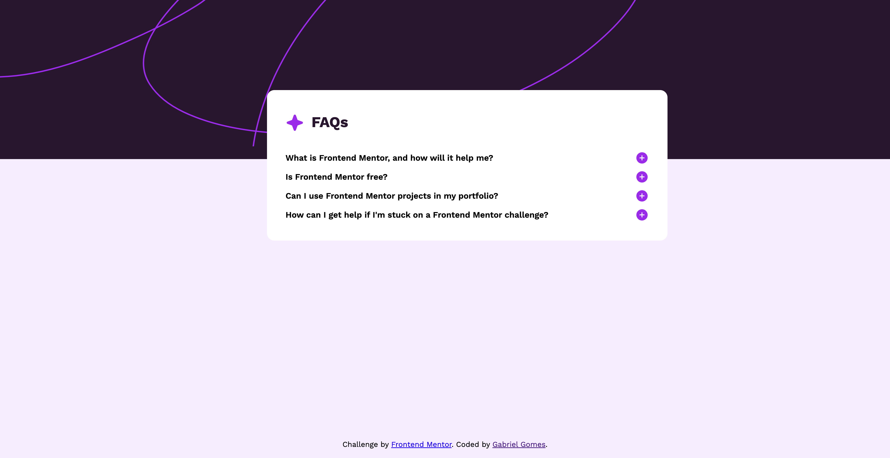

# Frontend Mentor - FAQ accordion solution

This is a solution to the [FAQ accordion challenge on Frontend Mentor](https://www.frontendmentor.io/challenges/faq-accordion-wyfFdeBwBz). Frontend Mentor challenges help you improve your coding skills by building realistic projects.

## Overview

### The challenge

Users should be able to:

- Hide/Show the answer to a question when the question is clicked
- Navigate the questions and hide/show answers using keyboard navigation alone
- View the optimal layout for the interface depending on their device's screen size
- See hover and focus states for all interactive elements on the page

### Screenshot



### Links

- [Solution URL](https://github.com/gomessgbr/faq-accordion-main)
- [Live Site URL](https://faq-accordion-main-blush.vercel.app/)

### Built with

- Semantic HTML5 markup
- CSS custom properties
- Flexbox
- CSS Grid
- Vanilla
- CSS3
- HTML5

### What I learned

While working through this project, I learned how to show an accordion paragraph when the user clicks on the titles.

```js
let acc = document.getElementsByClassName("accordion");
let icon = document.getElementsByClassName("iconButton");
for (let i = 0; i < acc.length; i++) {
  acc[i].addEventListener("click", function() {
    this.classList.toggle("active");
    let panel = this.nextElementSibling;
    if (panel.style.display === "block") {
      panel.style.display = "none";
      icon[i].src = './assets/images/icon-plus.svg';
    } else {
      panel.style.display = "block";
      icon[i].src = './assets/images/icon-minus.svg';
    }
  });
}
```


### Continued development

I want to develop my skills in mobile-first design and CSS responsiveness to accommodate both small and large screens.


## Author

- Frontend Mentor - [@gomessgbr](https://www.frontendmentor.io/profile/gomessgbr)


